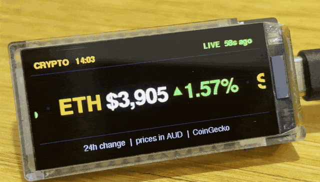

# Crypto Ticker

**NOT FOR COMMERCIAL USE.** Please reach out to me if you'd like to use it commercially. I am willing to come to an agreement.

Crypto Ticker is Arduino code for the LilyGO T-Display-S3 AMOLED (1.91", ESP32-S3). It scrolls live crypto prices across the screen like a stock exchange ticker board, showing each coin's price in AUD with a green ▲ or red ▼ for its 24-hour change. It also scrolls the daily Crypto Fear & Greed Index. Price data comes from the free CoinGecko API, and the Fear & Greed Index comes from alternative.me. No API keys or sign-ups are needed.

  

## Features

- **Scrolling ticker:** a smooth, flicker-free scroll of BTC, ETH, SOL, XRP, ADA and DOGE. You can change the coins.
- **Prices in AUD:** each coin shows its price with a green ▲ or red ▼ for the 24-hour % change. The currency can be changed to USD, EUR, and others.
- **Fear & Greed Index:** scrolls with the prices and is coloured from red (Extreme Fear) to green (Extreme Greed).
- **Header status:** a clock, plus **LIVE**, **STALE**, **CONNECTING** or **NO WIFI** so you can see at a glance whether the data is current.
- **Pause button:** press the BOOT button to freeze the scroll, and press it again to resume.
- **Burn-in protection:**
  - Night dimming, from 11 pm to 7 am by default.
  - A slow pixel shift of the static parts of the screen every 2 minutes.
  - Automatic resume if the ticker is left paused for 5 minutes.
- **Background updates:** prices refresh every 60 seconds without interrupting the scroll.

## Hardware

- [LilyGO T-Display-S3 AMOLED 1.91"]
- A USB-C data cable. Some cables only carry power, so if your board doesn't show up, try another cable.

## Wiring Diagram

None needed. The display, buttons and ESP32-S3 are all on the one board. Just plug it in with USB-C.

## Installation

1. **Install the Arduino IDE** (version 2.x) from [arduino.cc](https://www.arduino.cc/en/software).

2. **Install the ESP32 board package.** Go to `Tools > Board > Boards Manager`, search for `esp32` and install **esp32 by Espressif Systems, version 2.0.17**. The display driver in this project needs the 2.0.x series. Newer 3.x versions will not compile it.

3. **Install the libraries.** Go to `Tools > Manage Libraries` and install:
   - **TFT_eSPI** by Bodmer, used to draw everything off-screen before it's sent to the display. Use the default setup; you don't need to edit `User_Setup.h`.
   - **ArduinoJson** by Benoit Blanchon, version 7.x, used to read the data from CoinGecko and alternative.me.

   The following come with the ESP32 board package, so no install is needed: WiFi, WiFiClientSecure, HTTPClient and SPI.

4. **Open the sketch.** Open `crypto_ticker_amoled/crypto_ticker_amoled.ino`. Keep all the files in that folder together; the display driver and the large font are separate files.

5. **Add your Wi-Fi details** near the top of the sketch:
   ```cpp
   const char* WIFI_SSID = "YOUR_WIFI_NAME";
   const char* WIFI_PASS = "YOUR_WIFI_PASSWORD";
   ```
   The ESP32 only connects to **2.4 GHz** Wi-Fi.

6. **Select the board settings** in the `Tools` menu:

   | Setting | Value |
   |---|---|
   | Board | ESP32S3 Dev Module |
   | USB CDC On Boot | Enabled |
   | USB Mode | Hardware CDC and JTAG |
   | Flash Size | 16MB (128Mb) |
   | Partition Scheme | 16M Flash (3MB APP/9.9MB FATFS) |
   | PSRAM | **OPI PSRAM** (required) |

7. **Select the port** under `Tools > Port`. If the board isn't showing up:
   - Put it in download mode: hold **BOOT**, press and release **RST**, then let go of **BOOT**.
   - Check the port list again.

8. **Upload.** Hit `Verify`, then `Upload`. When it finishes, press **RST** once. You should see **CONNECTING...**, and then the ticker will start scrolling within about 10 seconds.

## Settings

Everything you're likely to want to change is in the `USER SETTINGS` block at the top of the sketch:

| Setting | Default | What it does |
|---|---|---|
| `coins[]` | BTC, ETH, SOL, XRP, ADA, DOGE | The coins to scroll. Uses [CoinGecko IDs](https://www.coingecko.com/), e.g. `"bitcoin"`, `"chainlink"`. |
| `CURRENCY` / `CURRENCY_SYM` | `"aud"` / `"$"` | The price currency and its symbol. |
| `TZ_INFO` | Sydney/Melbourne time | Your time zone, used for the clock and night dimming. Other Australian zones are listed in the comments. |
| `SCROLL_SPEED_PPS` | 110 | Scroll speed in pixels per second. |
| `SHOW_FEAR_GREED` | true | Shows or hides the Fear & Greed Index. |
| `BRIGHTNESS_DAY` / `BRIGHTNESS_NIGHT` | 180 / 35 | Screen brightness from 0 to 255. Set night to 0 to turn the screen off overnight. |
| `NIGHT_START_HOUR` / `NIGHT_END_HOUR` | 23 / 7 | The night dimming hours. |

## Usage

Plug USB-C into the board, and it should boot and start scrolling in less than 10 seconds.

- **BOOT button:** pauses and resumes the ticker. While paused, prices keep updating in the background. It resumes on its own after 5 minutes to protect the screen from burn-in.
- **Header status:**
  - **LIVE**: prices are current.
  - **STALE**: no update for a few minutes; it's still retrying.
  - **NO WIFI**: check your Wi-Fi details or signal.

Prices are delayed by roughly one minute because of the free API's limits, so don't use this for trading.

## Troubleshooting

- **`Set PSRAM: OPI PSRAM` error when compiling:** set `Tools > PSRAM` to **OPI PSRAM**.
- **Compile errors in `rm67162.cpp`:** you're on a 3.x ESP32 board package. Install **2.0.17** instead.
- **Screen stays black after upload:** press **RST**, because the board may still be in download mode.
- **Stuck on CONNECTING:** double-check the Wi-Fi name and password, and make sure your network is 2.4 GHz.

## Credits

- Display driver (`rm67162.cpp/.h`, `pins_config.h`) from [LilyGO's T-Display-S3-AMOLED examples](https://github.com/Xinyuan-LilyGO/T-Display-S3-AMOLED).
- Large font generated from [GNU FreeFont](https://www.gnu.org/software/freefont/) FreeSansBold with the Adafruit GFX `fontconvert` tool.
- Price data [powered by CoinGecko](https://www.coingecko.com/en/api).
- Fear & Greed Index data from [alternative.me](https://alternative.me/crypto/fear-and-greed-index/).
- Libraries: [TFT_eSPI](https://github.com/Bodmer/TFT_eSPI) by Bodmer and [ArduinoJson](https://github.com/bblanchon/ArduinoJson) by Benoit Blanchon.

## Changelog

See [CHANGELOG.md](CHANGELOG.md) for version history. The running version is printed to the Serial Monitor at boot, at 115200 baud.

## License

[](https://creativecommons.org/licenses/by-nc/4.0/)

This project is licensed under [CC BY-NC 4.0](https://creativecommons.org/licenses/by-nc/4.0/). You're free to use, share and modify it for personal, non-commercial projects, as long as you give credit. For commercial use, please reach out. The third-party files listed in Credits keep their own licences. See [LICENSE](LICENSE) for details.

## Support You

Whatever you need, whether it's questions answered, requests or bugs, make an Issue. I'll get to them as soon as I can.

## Support Me

If this project saved you time or made you smile, you can support future builds here:

[](https://ko-fi.com/resusone)
