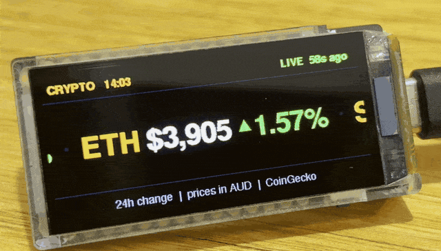

# Crypto Ticker

**NOT FOR COMMERCIAL USE.** Please reach out to me if you'd like to use it commercially. I am willing to come to an agreement.

Crypto Ticker is Arduino code for the LilyGO T-Display-S3 AMOLED (1.91", ESP32-S3). It scrolls live crypto prices across the screen like a stock exchange ticker board, showing each coin's price in AUD with a green ▲ or red ▼ for its 24-hour change. It also scrolls the daily Crypto Fear & Greed Index. Price data comes from the free CoinGecko API, and the Fear & Greed Index comes from alternative.me. No API keys or sign-ups are needed.

  

## Features

- **Scrolling ticker:** a smooth, flicker-free scroll of BTC, ETH, SOL, XRP, ADA and DOGE. You can change the coins.
- **Prices in AUD:** each coin shows its price with a green ▲ or red ▼ for the 24-hour % change. The currency can be changed to USD, EUR, and others.
- **Fear & Greed Index:** scrolls with the prices and is coloured from red (Extreme Fear) to green (Extreme Greed).
- **Header status:** a clock, plus **LIVE**, **STALE**, **CONNECTING** or **NO WIFI** so you can see at a glance whether the data is current.
- **Settings page:** add or remove coins, reorder them, and change the currency, speed, brightness, night hours and time zone from your phone or computer. No reflashing needed.
- **Wi-Fi setup from your phone:** no code editing needed. Scan the QR code on the screen, pick your Wi-Fi and enter the password.
- **Pause button:** press the BOOT button to freeze the scroll, and press it again to resume.
- **Burn-in protection:**
  - Night dimming, from 11 pm to 7 am by default.
  - A slow pixel shift of the static parts of the screen every 2 minutes.
  - Automatic resume if the ticker is left paused for 5 minutes.
- **Background updates:** prices refresh every 60 seconds without interrupting the scroll.

## Hardware

- [LilyGO T-Display-S3 AMOLED 1.91"]
- A USB-C data cable. Some cables only carry power, so if your board doesn't show up, try another cable.

## Wiring Diagram

None needed. The display, buttons and ESP32-S3 are all on the one board. Just plug it in with USB-C.

## Quick Install (no software needed)

1. Download `CryptoTicker_vX.X.X_merged.bin` from the [latest release](https://github.com/resusone/Crypto-Ticker-amoled/releases/latest).
2. Open a web flasher in Chrome or Edge, for example [Espressif's ESP Tool](https://espressif.github.io/esptool-js/).
3. Put the board in download mode: hold **BOOT**, press and release **RST**, then let go of **BOOT**.
4. Click **Connect** and choose the port.
5. Click **Erase Flash** and wait for it to finish.
6. Add the `.bin` file at address **0x0**, then click **Program**.
7. When it finishes, press **RST** and follow the Wi-Fi setup below.

## Wi-Fi Setup

The first time it starts, the ticker shows a **Wi-Fi Setup** screen with a QR code.

1. **Join the setup network:** scan the QR code with your phone's camera, or join the Wi-Fi network shown on screen (`CryptoTicker-XXXX`).
2. **Choose your Wi-Fi:** a setup page opens automatically. If it doesn't, open **192.168.4.1** in your browser. Tap **Configure WiFi** and pick your home network.
3. **Save:** enter your password and tap **Save**.

The ticker connects and starts scrolling, and it remembers your network from then on. To change networks later, **hold the BOOT button for 5 seconds**.

The ESP32 only connects to **2.4 GHz** Wi-Fi.

## Settings Page

Once the ticker is on your Wi-Fi, open **http://cryptoticker.local** in a browser on any phone or computer connected to the same network. If that address doesn't work, use the IP address shown at the bottom of the ticker's screen. The address appears for 30 seconds after the ticker connects, and any time the ticker is paused, so a short button press brings it back.

From the settings page you can:

- **Coins:** search for coins to add (up to 20), remove them, and change their order.
- **Currency:** AUD, USD, NZD, EUR, GBP, CAD or SGD.
- **Scroll speed:** and whether the Fear & Greed Index is shown.
- **Brightness:** separate day and night brightness, and the night-mode hours.
- **Time zone:** used for the clock and night mode.

Tap **Save** and the ticker updates straight away. Settings are stored on the ticker, so they survive power cuts and restarts. **Restore default settings** puts everything back to how it came.

The settings page is only reachable from your own Wi-Fi network, and it has no password. Anyone on your Wi-Fi can open it, so keep that in mind on shared networks.

## Installation (Arduino IDE, to edit the code)

1. **Install the Arduino IDE** (version 2.x) from [arduino.cc](https://www.arduino.cc/en/software).

2. **Install the ESP32 board package.** Go to `Tools > Board > Boards Manager`, search for `esp32` and install **esp32 by Espressif Systems, version 2.0.17**. The display driver in this project needs the 2.0.x series. Newer 3.x versions will not compile it.

3. **Install the libraries.** Go to `Tools > Manage Libraries` and install:
   - **TFT_eSPI** by Bodmer, used to draw everything off-screen before it's sent to the display. Use the default setup; you don't need to edit `User_Setup.h`.
   - **ArduinoJson** by Benoit Blanchon, version 7.x, used to read the data from CoinGecko and alternative.me.
   - **WiFiManager** by tzapu, version 2.0.17, used for the phone Wi-Fi setup.

   The following come with the ESP32 board package, so no install is needed: WiFi, WiFiClientSecure, HTTPClient and SPI.

4. **Open the sketch.** Open `crypto_ticker_amoled/crypto_ticker_amoled.ino`. Keep all the files in that folder together; the display driver, QR code generator and large font are separate files. There's no need to add Wi-Fi details to the code, because they're set up from your phone.

5. **Select the board settings** in the `Tools` menu:

   | Setting | Value |
   |---|---|
   | Board | ESP32S3 Dev Module |
   | USB CDC On Boot | Enabled |
   | USB Mode | Hardware CDC and JTAG |
   | Flash Size | 16MB (128Mb) |
   | Partition Scheme | 16M Flash (3MB APP/9.9MB FATFS) |
   | PSRAM | **OPI PSRAM** (required) |

6. **Select the port** under `Tools > Port`. If the board isn't showing up:
   - Put it in download mode: hold **BOOT**, press and release **RST**, then let go of **BOOT**.
   - Check the port list again.

7. **Upload.** Hit `Verify`, then `Upload`. When it finishes, press **RST** once, then follow the [Wi-Fi Setup](#wi-fi-setup) steps.

## Default Settings

Most settings are changed from the [Settings Page](#settings-page) and don't need any code changes. The factory defaults are at the top of the sketch, under `DEFAULT SETTINGS`, if you'd like different ones in your own build:

| Setting | Default |
|---|---|
| Coins | BTC, ETH, SOL, XRP, ADA, DOGE |
| Currency | AUD |
| Time zone | Sydney / Melbourne / Canberra / Hobart |
| Scroll speed | 110 pixels per second |
| Fear & Greed Index | On |
| Day / night brightness | 180 / 35 (out of 255) |
| Night mode | 11 pm to 7 am |

## Usage

Plug USB-C into the board, and it should boot and start scrolling in less than 10 seconds.

- **BOOT button, short press:** pauses and resumes the ticker. While paused, prices keep updating in the background. It resumes on its own after 5 minutes to protect the screen from burn-in.
- **BOOT button, hold 5 seconds:** clears the saved Wi-Fi and restarts into Wi-Fi setup. A countdown appears after 1 second, so you can let go to cancel.
- **Header status:**
  - **LIVE**: prices are current.
  - **STALE**: no update for a few minutes; it's still retrying.
  - **NO WIFI**: it can't reach your network and keeps retrying. If your Wi-Fi has changed, hold the button for 5 seconds to set it up again.

Prices are delayed by roughly one minute because of the free API's limits, so don't use this for trading.

## Troubleshooting

- **`Set PSRAM: OPI PSRAM` error when compiling:** set `Tools > PSRAM` to **OPI PSRAM**.
- **Compile errors in `rm67162.cpp`:** you're on a 3.x ESP32 board package. Install **2.0.17** instead.
- **Screen stays black after upload:** press **RST**, because the board may still be in download mode.
- **`cryptoticker.local` doesn't open:** some Android phones and older Windows computers don't support `.local` addresses. Use the IP address shown on the ticker instead: short-press the button to pause, and the address appears at the bottom.
- **Coin search doesn't work on the settings page:** open **Add by CoinGecko ID instead** and type the coin's ID. It's the last part of the coin's page address on coingecko.com, for example `chainlink`.
- **A coin shows `---`:** the CoinGecko ID is probably wrong. Remove it and add it again using search.
- **Stuck on CONNECTING or NO WIFI:** hold the button for 5 seconds and set up Wi-Fi again, checking the password. Make sure your network is 2.4 GHz.
- **Setup page doesn't open on your phone:** stay connected to `CryptoTicker-XXXX` and open **192.168.4.1** in your browser. Some phones ask "this network has no internet, stay connected?" Tap **Yes** or **Keep**.
- **"Setup timed out" on screen:** nobody finished setup within 10 minutes. Press the button to try again.

## Credits

- Display driver (`rm67162.cpp/.h`, `pins_config.h`) from [LilyGO's T-Display-S3-AMOLED examples](https://github.com/Xinyuan-LilyGO/T-Display-S3-AMOLED).
- Large font generated from [GNU FreeFont](https://www.gnu.org/software/freefont/) FreeSansBold with the Adafruit GFX `fontconvert` tool.
- Price data [powered by CoinGecko](https://www.coingecko.com/en/api).
- Fear & Greed Index data from [alternative.me](https://alternative.me/crypto/fear-and-greed-index/).
- Libraries: [TFT_eSPI](https://github.com/Bodmer/TFT_eSPI) by Bodmer, [ArduinoJson](https://github.com/bblanchon/ArduinoJson) by Benoit Blanchon, and [WiFiManager](https://github.com/tzapu/WiFiManager) by tzapu.
- QR code generator (`qrcode_rm.c/.h`) from [ricmoo/QRCode](https://github.com/ricmoo/QRCode) (MIT licence), renamed to avoid a clash with the ESP32's built-in `qrcode.h`.

## Changelog

See [CHANGELOG.md](CHANGELOG.md) for version history. The running version is printed to the Serial Monitor at boot, at 115200 baud.

## License

This project is licensed under [CC BY-NC 4.0](https://creativecommons.org/licenses/by-nc/4.0/). You're free to use, share and modify it for personal, non-commercial projects, as long as you give credit. For commercial use, please reach out. The third-party files listed in Credits keep their own licences. See [LICENSE](LICENSE) for details.

## Support You

Whatever you need, whether it's questions answered, requests or bugs, make an Issue. I'll get to them as soon as I can.

## Support Me

If this project saved you time or made you smile, you can support future builds here:

